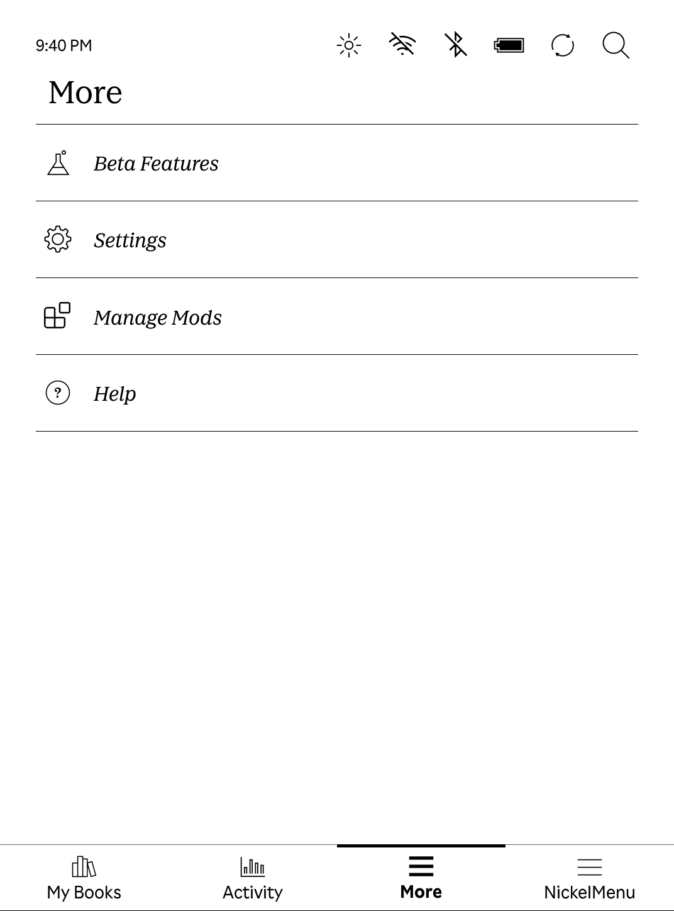
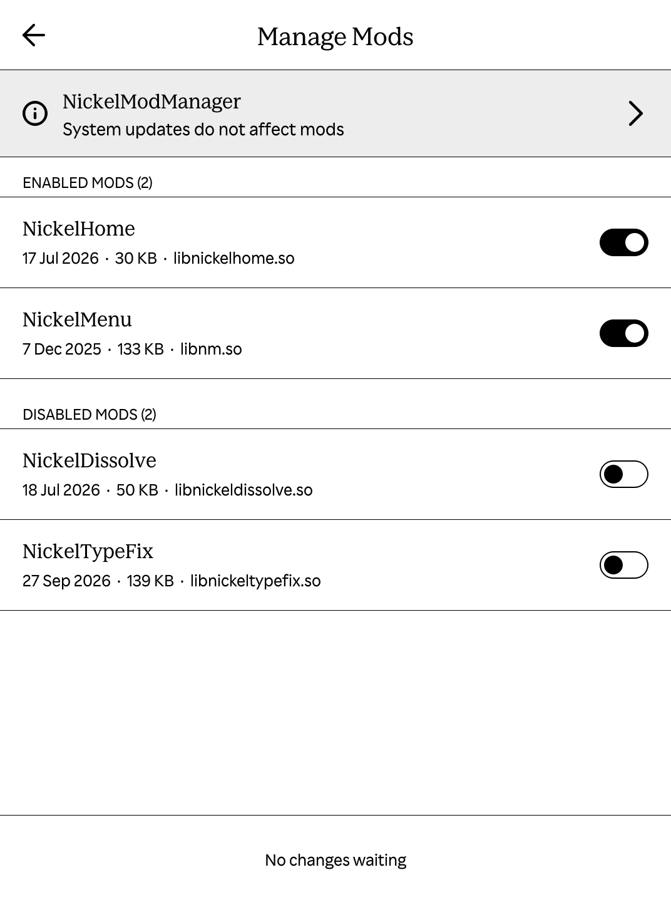

# NickelModManager

NickelModManager adds the **Manage Mods** item to Nickel's **More** tab. It lists installed mods and lets you turn them off and on. Changes apply after a restart. It keeps a copy of each mod on user storage, so a mod you turn off can be turned on again later.

The mod currently supports software 4.23+, which means that it can be installed on most devices.

> [!NOTE]
> Support for firmware 5.x and 6.x is under development.

    <kbd></kbd>
    <kbd></kbd>

## Install

Download `KoboRoot.tgz` from the [latest release](https://github.com/nicoverbruggen/NickelModManager/releases/latest). Copy it to `.kobo/` on the eReader, eject it and restart.

Tap **More** > **Manage Mods** to change which mods load at the next start. Mods are listed as enabled or disabled. A mod that failed to load has its own section, and turning it on again asks for confirmation first. NickelModManager itself cannot be turned off from this screen; its card at the top shows its version and details.

Ordinary NickelHook-based mods need no changes to work with the manager. Each mod remains responsible for its own compatibility checks and hooks.

## Remove

Turn on any mods you want to keep using first. Connect by USB, then delete `.adds/nickel-mod-manager/uninstall` or the whole `.adds/nickel-mod-manager` folder, eject and restart. 

NickelModManager removes its library at that start. Other installed mods stay installed, and mods you turned off stay off. Deleting only the `uninstall` file keeps the saved copies of your mods; deleting the folder removes them too.

To reinstall, copy the package again. The uninstall marker is created again on the first start. If the first start after installing, updating or a firmware update fails before Home has been up for three seconds, the manager stays disabled by its failsafe. Reinstalling retries startup.

## Development

See [DEVELOPER.md](DEVELOPER.md) for builds, source layout, tests, recovery behavior and device verification.

## Licence

NickelModManager uses the [MIT licence](LICENSE). Its Lucide icons retain their [ISC and MIT notice](src/ui/icons/LICENSE).
